# メール処理の自動化と自動通知

## 内容

- 問合せメールがきたときに、相手に対して自動でメールの返信をおこない、関係者に自動でメール通知する例。
- 会社全体のメールに対するルールを決める例として、メールフロー機能を用いてファイルサイズが2MBを超えるサイズのファイルはメールマナーとして送信を禁止するルールを適用する。。

## メリット

> [!IMPORTANT]
>
>- お問い合わせに対する自動返信メールの処理例をExchangeを利用しても実現できることを確認する。
>- Exchangeのメールフロー機能を用いれば、会社全体でのメール送信ルールに違反した場合は理由を明示して送信できないようにルール決めを自動適用できることを理解し、メールルールを強制的に適用でき、教育にも展開できることを理解する。

## 詳細

- [トランスポート利用例1](https://qiita.com/sa_touuu/items/a5d15652a51ab17f43e9)
- トランスポートルールを作成参考図書265_381
- その他のセキュリティサービスと併用して、強固なメールセキュリティ対策を実施することが可能。

---

## デモサンプル例

### デモ画像

#### 10_自動応答の設定

> [!NOTE]
> 10:Exchange管理センターから、問合せの受信メッセージに対する自動応答の設定画面へ移動する

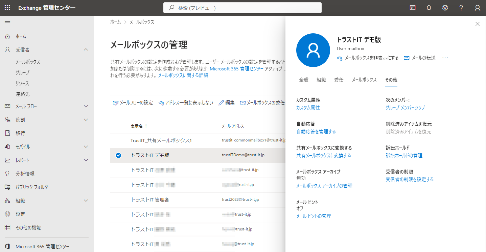

　11:下図のように自動応答する際の応答メッセージを設定する。

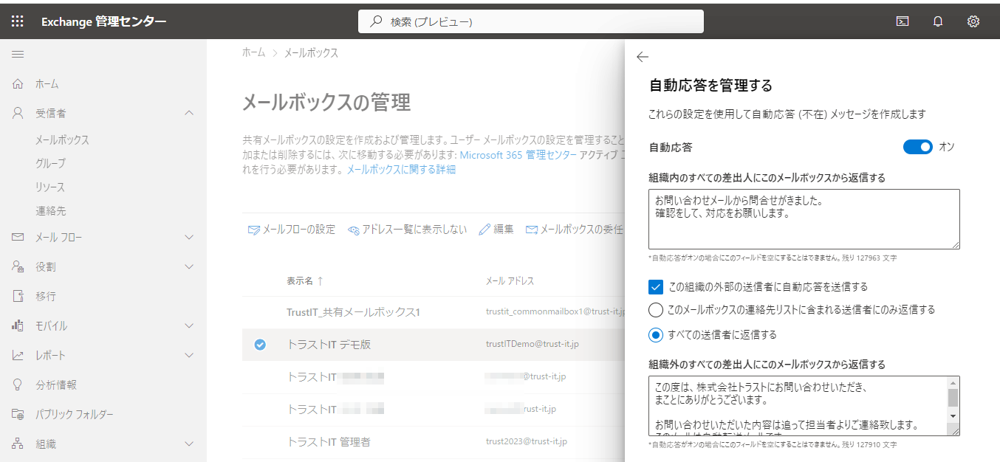

---

#### 20_メール自動転送の設定

> [!NOTE]
> 20:問合せの受信メッセージを関係者に自動転送する設定をおこなう。

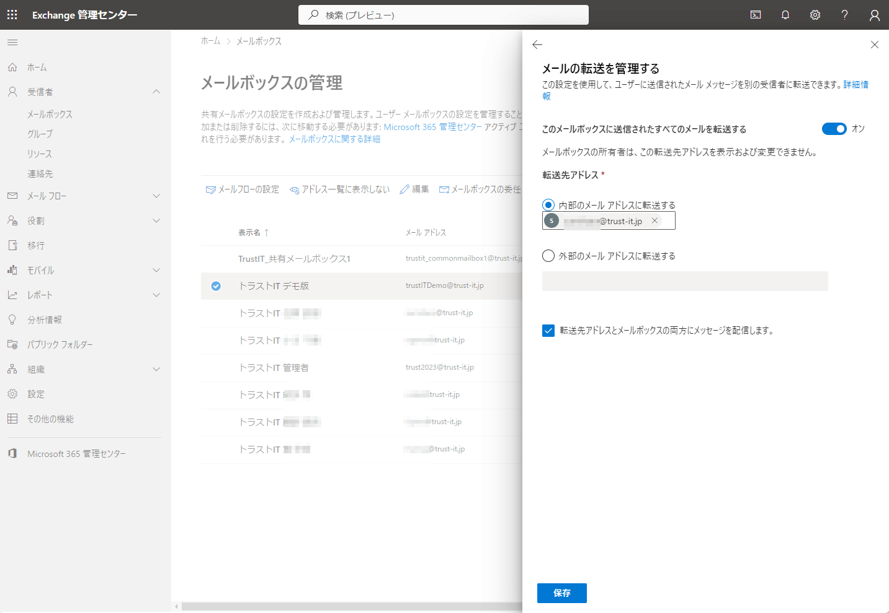

---

#### 30_問合せメールの受信後の自動処理

> [!NOTE]
> 30:問合せのメールが問合せ受付専用のメールアドレス宛に送られてきたと仮定。

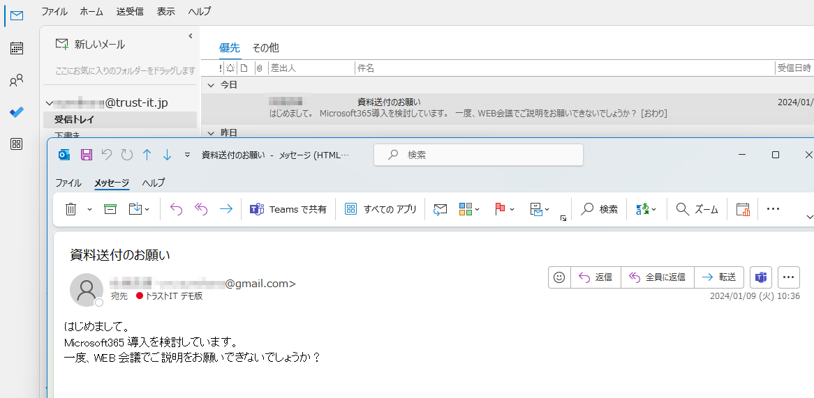

> 31:受付専用のメールアドレスにてまずメールを受信。自動応答される設定になっている場合、上部にもその旨も表示される。

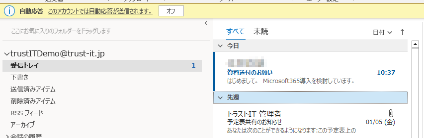

> 32:下図のように受信したメールは関係者にも自動転送します。

> 32:下図のようにメールを送信した相手にもメールを自動返信します。

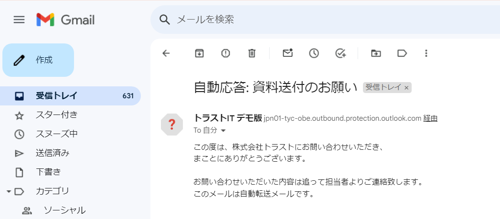

> 33:メール以外にもTeamsを用いて、関係チャネルに情報展開することも可能です。

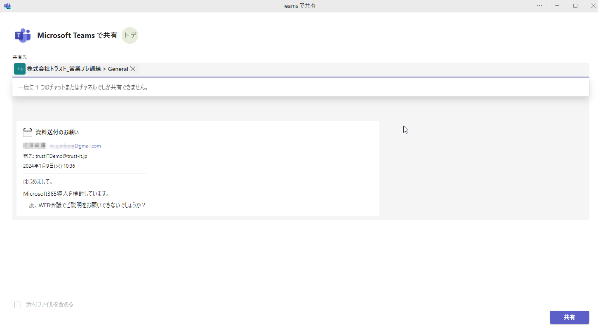

---

#### 40_メールフローのトランスポートルールを利用して、ルールの作成

> [!NOTE]
> 40:下図のように添付ファイルのサイズが2MBを超える場合は、メールの送信を禁止するルールを作成する。

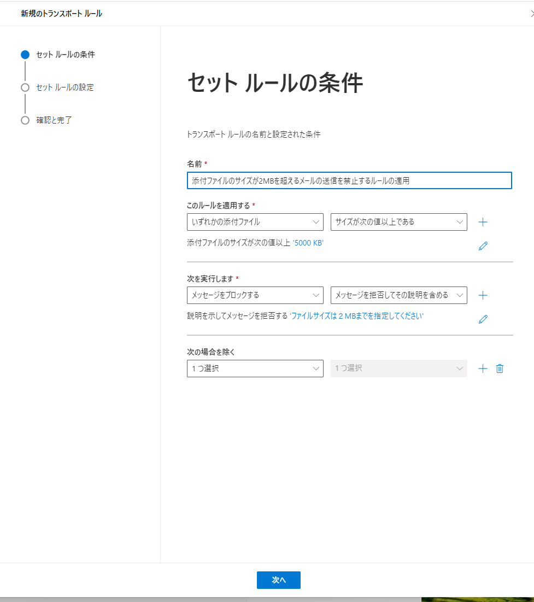
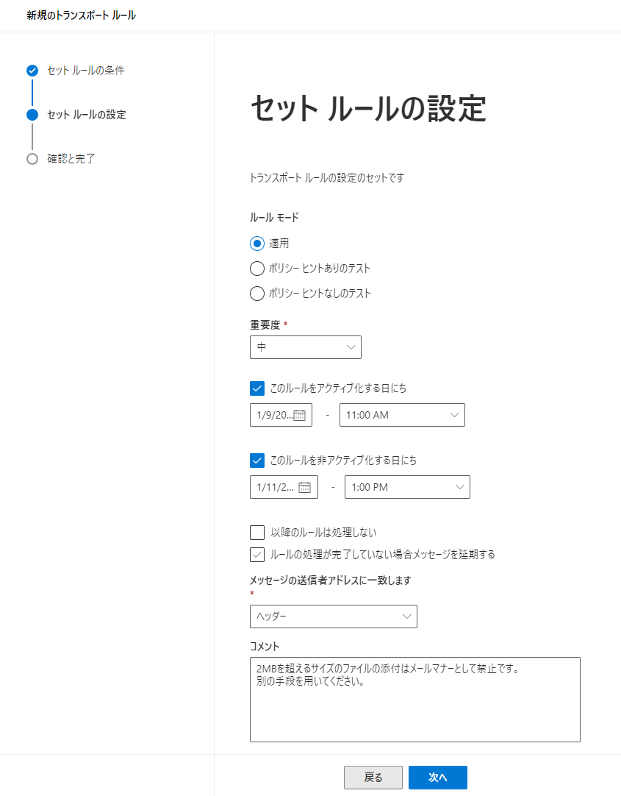
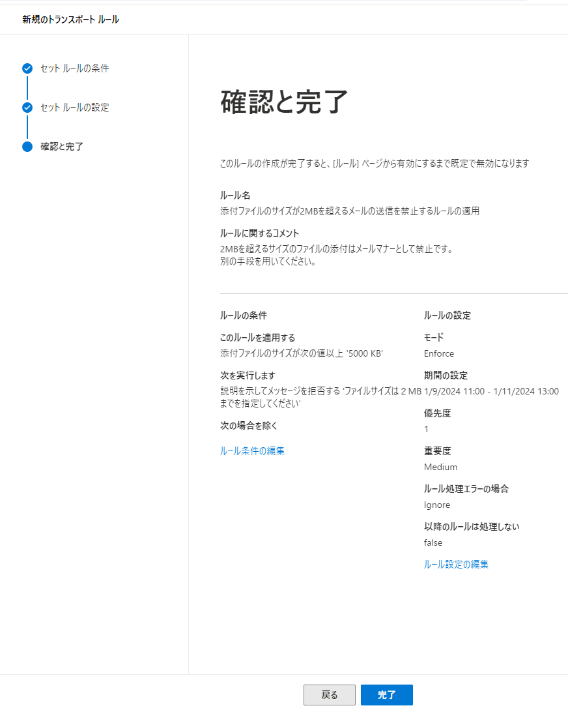
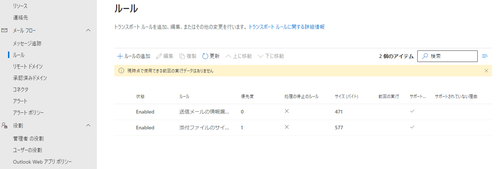

---

#### 50_ルールを逸脱したメールの送信を禁止

> [!NOTE]
> 50:作成した2MBを超えたファイルを送信しようとした場合の対応

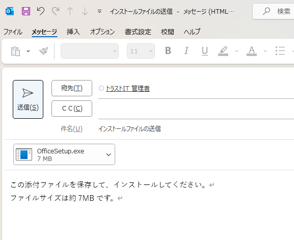

> 51:下図のように送信しようとすると、ルールを逸脱している旨の警告メッセージで注意を促すことができる。

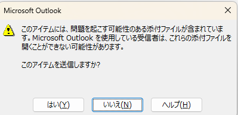

> 52:警告を無視して強制送信しても、エラーメールで返却され、ルールを逸脱したメールは送信できないように対応することが可能。

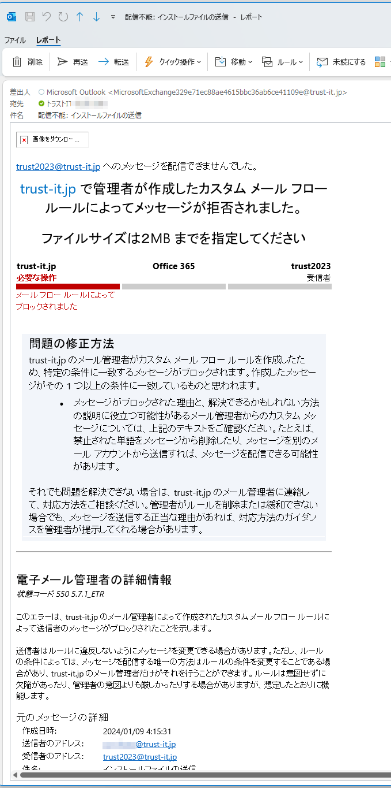

---

## 引用文献

> 参考図書265_381:「ひと目でわかるOffice 365メール設定管理編Exchange Server 2016対応版」の77ページ,日経BP,2018,エディフィストラーニング株式会社 飯室 美紀  
